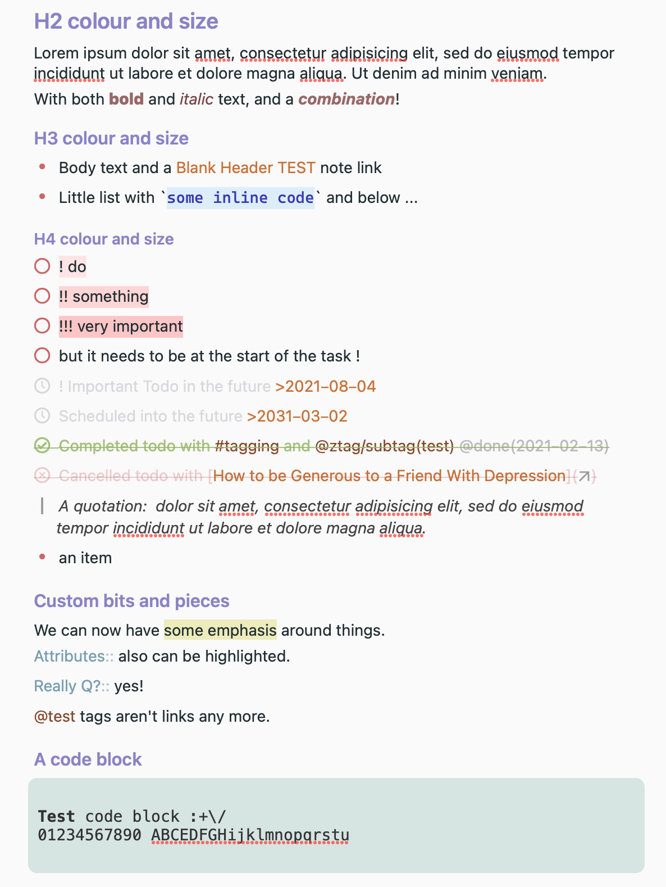
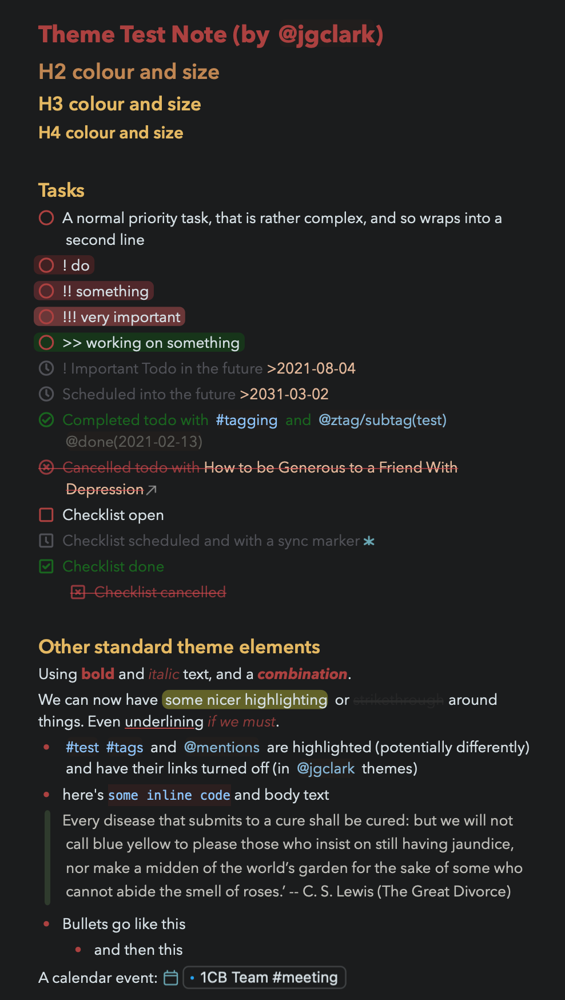
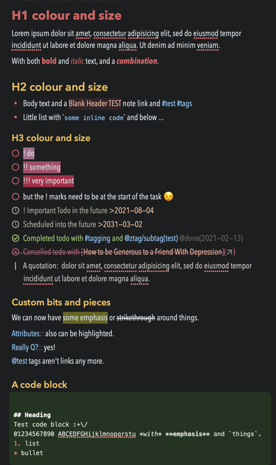

# NotePlan Themes by jgclark

[NotePlan app](https://noteplan.co/) has fairly extensive [theming capabilities]().

Here are the two pairs of Themes that I use and maintain for you to use, study or pilfer as you feel like.  Remember that you can change the overall font size in Preferences > Editor > Editor Font Size.

They feature `!` / `!!` / `!!!` priority markers with highlighting; strikethrough; highlighting; field keyword colouring; attributes; hiding of `[[...]]` markers surrounding note links, partially-hidden comments at the end of a line following `//` etc.

### Toothbleach JGC / Toothpaste JGC
Toothbleach sample:

Toothpaste sample:

And if you want you can also use [my sample note to test Themes](https://noteplan.co/n/D38E5E06-959F-4570-9253-C7142C76EF02), part of which is shown above.

### Toothbleach Condensed / Toothpaste Condensed

This pair are particularly useful when working on small screens. They are the same as the above, but use the "Avenir Next Condensed" font (which might or might not be installed on your system). If you have a different preferred condensed font, then you can change to that by editing the theme file as described in the link above.

Credit: I'm afraid I now can't remember who started the original Tooth* pair, but let me know and I'll credit them. They have been extended a lot since, mind you.
