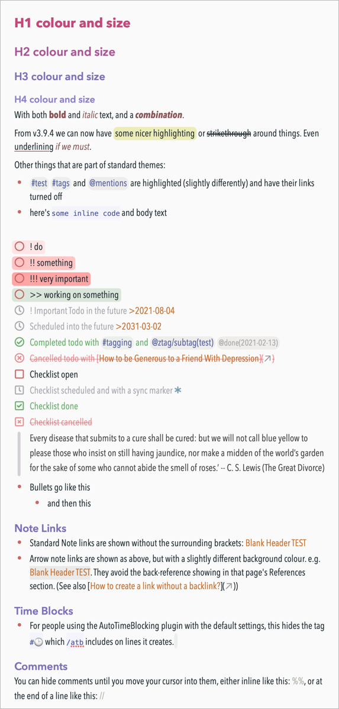

# NotePlan Themes by jgclark

[NotePlan app](https://noteplan.co/) has fairly extensive [theming capabilities](https://help.noteplan.co/article/44-customize-themes). Here are the two pairs of Themes that I use and maintain for you to use, study or pilfer as you feel like.

## Toothbleach Condensed JGC / Toothpaste Condensed JGC
*This pair of themes have been updated to use new theming features in NotePlan v3.9.4.*

*They had been called 'Tooth... Condensed', but then versions of this were incorporated into the main app, and so I've had to change the name to stop ambiguity for further development of these custom themes.*

They feature:
- `!` / `!!` / `!!!` priority markers with highlighting (red highlights)
- `>>` working-on indicator (green highlight)
- `~~strikethrough~~`;
- `==highlighting==`
- `~underlining~`
- `field: keyword` colouring at the start of a line (particularly for frontmatter)
- hiding of `[[...]]` markers surrounding note links
- hiding of `[...](↗︎)` markers surrounding URLs (but keep the ↗︎)
- `>Note Title<` for Arrow Links: a way to create links to a note by title, like `[[note link]]`, but without the back-reference showing in that page's References section. Especially useful for pages you link to many times (e.g. from a daily note template).
- `attribute::` colouring at the start of a line
- `// hidden comments` at the end of a line
- `%%hidden comments%%` anywhere in a line
- `!YYYY-MM-DD` deadline dates are emphasised
- `<...>` tags in templates are in monospace font
- times that define time blocks are coloured
- a `#🕑` tag is hidden. (For people using /AutoTimeBlocking with the default settings, this hides the tag "#🕑" which /atb includes on lines it creates.)
- a `???` string is coloured bright red. This can be used to indicate something unfinished.

This pair are particularly useful when working on small screens. They are the same as the above, but use the "Avenir Next Condensed" font (which might or might not be installed on your system). If you have a different preferred condensed font, then you can change to that by editing the theme file as described in the link above.

## Toothbleach JGC / Toothpaste JGC
*This pair of themes have **not** yet been updated to use new theming features in NotePlan v3.9.4. This is so there is something to use for people on earlier versions.*

Toothpaste sample:

## Other notes
You can also use my sample **[Theme test note](https://noteplan.co/n/D38E5E06-959F-4570-9253-C7142C76EF02)**, part of which is shown above.

You can change the overall **font size** in Preferences > Editor > Editor Font Size.

Credit: I'm afraid I now can't remember who started the original Tooth* pair, but let me know and I'll credit them. Mind you, they've been extensively modified since then.

[NotePlan theme changelog](https://help.noteplan.co/article/211-theme-changelog).