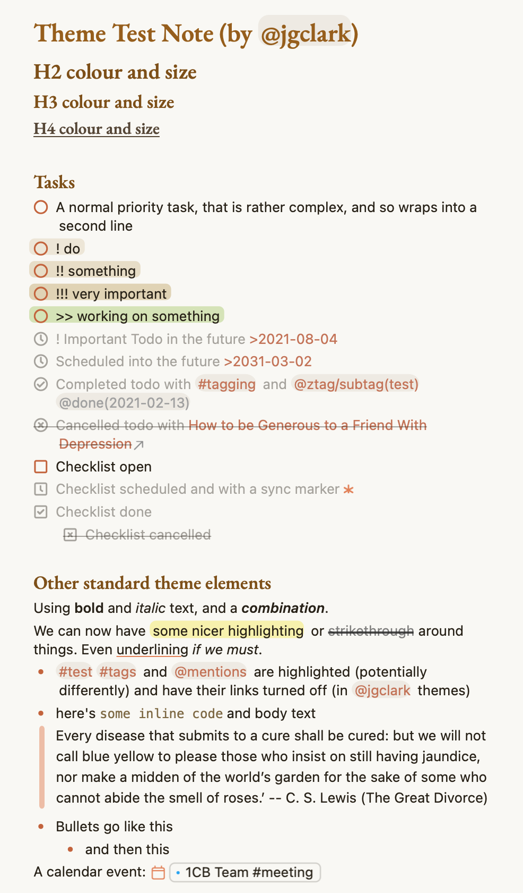

# NotePlan Themes by jgclark

[NotePlan app](https://noteplan.co/) has fairly extensive [theming capabilities](https://help.noteplan.co/article/44-customize-themes). Here are the three pairs of Themes that I use and maintain for you to use, study or pilfer as you feel like.

## Special Features
They all feature:
- hiding of `[[...]]` markers surrounding note links
- hiding of `[...](↗︎)` markers surrounding URLs (but keep the ↗︎)
- 'callback buttons' that make a pseudo-button out of a NP x-callback markdown link (see below for details)
- `>Note Title<` for Arrow Links: a way to create links to a note by title, like `[[note link]]`, but without the back-reference showing in that page's References section. Especially useful for pages you link to many times (e.g. from a daily note template).
- `!` / `!!` / `!!!` priority markers with highlighting
- `>>` working-on indicator (green highlight)
- `~~strikethrough~~`;
- `==highlighting==`
- `~underlining~`
- `// hidden comments` at the end of a line
- `%%hidden comments%%` anywhere in a line
- `!YYYY-MM-DD` deadline dates are emphasised
- `<...>` tags in templates are in monospace font
- times that define time blocks are coloured
- a `#🕑` tag is hidden. (For people using /AutoTimeBlocking with the default settings, this hides the tag "#🕑" which /atb includes on lines it creates.)
- a `???` string is coloured bright red. This can be used to indicate something unfinished.
- all the text after a `¶` symbol on a line is coloured. (This is a 'Pilcrow' mark, which can be typed on macs by Alt-7.)
- `field: keyword` colouring at the start of a line (particularly useful before there was a separate frontmatter editor).

## Claude.ai JGC / Claude.ai Dark JGC
These pick up fonts and colours from the Claude AI apps, as far as possible, and was inpsired by a simpler version shipped with NotePlan.  

Unfortunately, the lovely serif font Anthropic uses is proprietary, so can't be used in NP. However, these theme uses what I think is the best freely-available equivalent, called 'EB Garamond'. Unfortunately it is not provided by Apple, so _you will need to download it_ from [Google Fonts - EB Garamond](https://fonts.google.com/specimen/EB+Garamond) first, and install it on your system before you can use it. 

Note: To make them available on iOS or iPadOS you will need to create a 'profile' and install it on each device. To do this requires you to use either a (paid) third party app, or Apple's own "Apple Configurator" app, available for free from the App Store.

Claude JGC sample:



The body font is the same as Claude uses for user input, which is Apple's built-in sans font. If you wish, you can change the body font to use EB Garamond as well. To do this change the "body" section lines from

```json
    "font": ".AppleSystemUIFont",
    "size": 16,
```
to
```json
    "font": "EBGaramondRoman-Regular",
    "size": 18,
```

## Toothbleach Condensed JGC / Toothpaste Condensed JGC
*They had been called 'Tooth... Condensed', but then versions of this were incorporated into the main app, and so I've had to change the name to stop ambiguity for further development of these custom themes.*

This pair are particularly useful when working on **small screens**. They are the same as the above, but use the "Avenir Next Condensed" font (which might or might not be installed on your system). If you have a different preferred condensed font, then you can change to that by editing the theme file as described in the link above.  Here's a sample:


## Toothbleach JGC / Toothpaste JGC
They are the same as the 'Condensed' pair above, except that they use the regular width "Avenir Next" fonts. Here's a sample:


## Callback buttons
These make pseudo-buttons out of NP x-callback calls in markdown links. For example: 
```markdown
=b=[▶️ Start day](noteplan://x-callback-url/runPlugin?pluginID=jgclark.DailyJournal&command=dayStart)=b=
```
becomes the first of these buttons:


## Other notes
You can also use my sample **[Theme test note](https://noteplan.co/n/D38E5E06-959F-4570-9253-C7142C76EF02)**, part of which is shown above.

You can change the overall **font size** in Preferences > Editor > Editor Font Size.

Credit: I'm afraid I now can't remember who started the original Tooth* pair, but let me know and I'll credit them. Mind you, they've been extensively modified since then.

You might also want to consult [NotePlan's theme changelog](https://help.noteplan.co/article/211-theme-changelog).